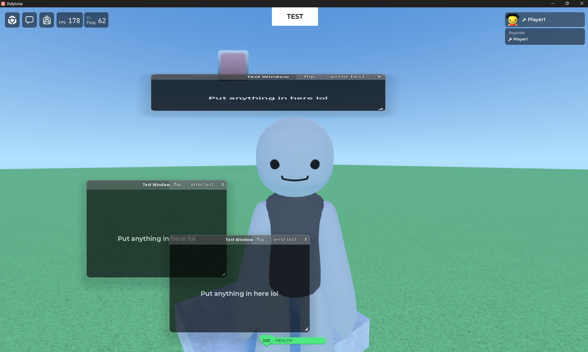

# PolyWindow REBUILT
A port of Q-WINC to Polytoria 2.0 done by rebuilding.

## Setup
The in-engine module file structure is the same as on-disk, with a few changes.
For files inside "Modules/PolyWindow", put them all as a descendant of the `PolyWindow.luau` instance.
For PluginSettings, visit scripts/modules/PolyWindow/Plugins/README.txt

Of course, you can just open `main.poly` in Polytoria Creator 2.0 to instantly get the structure and maybe copy it from one project to another.

## Testing
You can open `main.poly` in Polytoria Creator 2.0 to instantly test it, or alternatively the [published version](https://polytoria.com/places/144842) to give me bricks from visits, which is the simplest form of donation. I don't know how to split them between contributors yet though.

## Troubleshooting
IF for some reason Polytoria 2.0's `def.d.luau` file breaks again due to slightly destructive changes made on the Luau language, I'd recommend installing the `Luau LSP - Order` VSCode extension by Atomic Horizon **v1.67.2** alongside the `Luau Language Server` VSCode extension by Johnny Morganz (any version). It will magically evaporate away your problems about Polytoria 2.0 definitions failing to load which resulted in a billion error lints.

## Contributors

The silly built-in GitHub contributor tracker might miss people, so here's an extended list, managed by AllContributions bot:

<!-- ALL-CONTRIBUTORS-LIST:START - Do not remove or modify this section -->
<!-- ALL-CONTRIBUTORS-LIST:END -->

## Contacts

You can go to the [Discussions](https://github.com/mmmmmmmmArbdghn/PolyWindow-REBUILT/discussions) tab to ask questions.